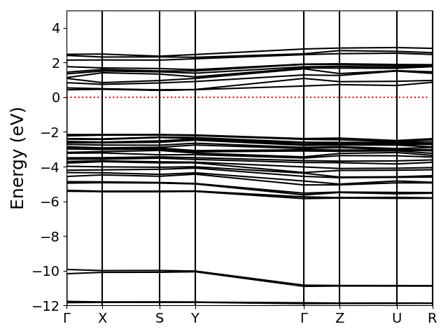
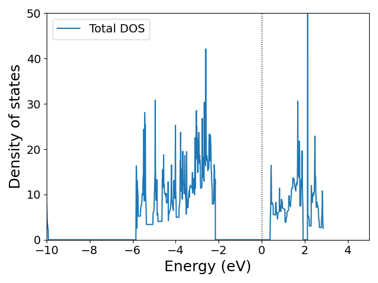

# 結果と考察

本課題では、BiSBrの電子構造について、粗い波数メッシュを用いた計算を実施した。得られた結果は、バンド構造と状態密度の二つの観点から整理し、それぞれについて以下で考察を行う。

## 電子バンド構造

BiSBrにおける電子バンド構造を、右下の図に示した。図を見ると、前述のように波数の解像度が高くないためバンド構造に不連続性などがみられ、判断に若干迷うところではあるが、価電子帯の最上位と伝導帯の最下位が同一の高対称性点に位置していることがわかった。このことから、BiSBrは直接型半導体であると考えられる。これについては文献で報告されている電子構造と一致することがわかった。すなわち、光学遷移においてフォノンを介さずに電子が励起されるため、光吸収特性において有利な性質を持つといえる。

## 状態密度

BiSBrにおける状態密度を、右下の図に示した。PDOS（射影状態密度）は未算定ではあるが、対象物質が非遷移元素系化合物である点を踏まえると、状態密度から見積もられるバンド幅はかなり広く典型的な半導体として振る舞いが認められ、電子の局在効果などはごくごく限定的であることが示唆される。これは、上述のように波数メッシュの粗さのため状態密度から半値幅を正確に求めることが難しくしているが、見積もられるバンド幅は半導体のそれに分類される程度に大きいことがわかった。このように、バンド構造や状態密度から観察される特徴は物性の理解において重要な知見となる。

層間距離の短さから、vdW相互作用が構造安定性に影響を与えている可能性が示唆される。この補正の導入が、電子構造計算におけるバンド図や状態密度に反映されていると考えられる。vdW補正の有無による構造的・電子的性質の変化については、今後の検討課題として残されている。
