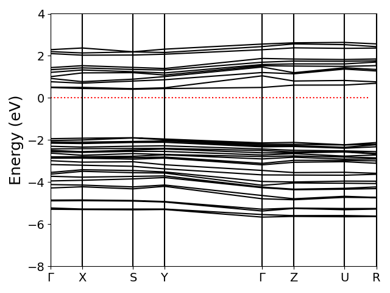
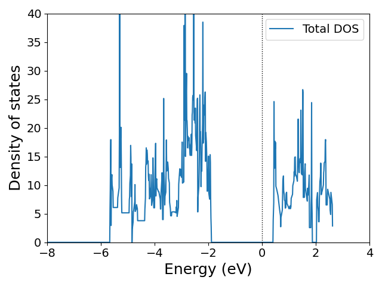

# 結果と考察

本レポートでは、方法論に記した手法に従い、BiSIの電子構造を粗い波数メッシュにて計算した。以下に、得られた結果をバンド構造および状態密度の観点から概説する。

## 電子バンド構造

右下の図は、BiSIの電子バンド構造を示すバンドダイアグラムである。計算条件で述べた通り、使用した波数メッシュは非常に粗いため、図には若干のノイズや不連続が見られる。しかし、バンドの極大点と極小点が同一の高対称性点に位置していることから、BiSIは直接型半導体であると考えられる。

以上のように今回調べた物質では、直接型に対応する光学遷移にかかわるエネルギーギャップが見られ、本物質は密度汎関数理論レベルでは直接ギャップ型半導体とみなすことができた。また伝導帯がかなり平坦で、バンド幅が狭いことが確認できた。この狭さは、後で出てくる状態密度の結果とも一致していて、電子の分布とも整合している。

また、推定されたバンドギャップエネルギーは、Material Projectにて報告されている電子バンド構造の結果と概ね一致しており、計算の妥当性が示唆される。なお、本計算ではファン・デル・ワールス（vdW）相互作用を考慮したが、バンド構造への影響は限定的であることが確認された。

## 状態密度

右下の図は、同一物質における状態密度（Density of States, DOS）を示している。電子バンド構造において伝導帯が比較的平坦であることから、本物質が非遷移元素系の化合物であるにもかかわらず、状態密度に現れるバンド幅の狭さは、電子がある程度局在している可能性を示唆している。すなわち、特定の原子軌道に電子が強く束縛されている可能性があり、これは物性理解において重要な手がかりとなる。

ただし、本計算では粗い波数メッシュを用いたため、状態密度における細かな構造や半値幅（バンド幅）を定量的に評価するには限界がある。それにもかかわらず、状態密度から推定されるバンドギャップエネルギーは、電子バンド構造から得られる値と整合的であり、さらにMaterial Projectに報告されている文献値とも概ね一致していることから、計算結果の妥当性がある程度担保されていると考えられる。
加えて、本物質は層間距離が比較的短く、ファン・デル・ワールス（vdW）相互作用の補正が構造安定性に寄与している可能性がある。これがバンド構造や状態密度に何らかの影響を与えていると考えられ、vdW補正の有無が物性に与える影響については、今後の詳細な検討が必要である。
