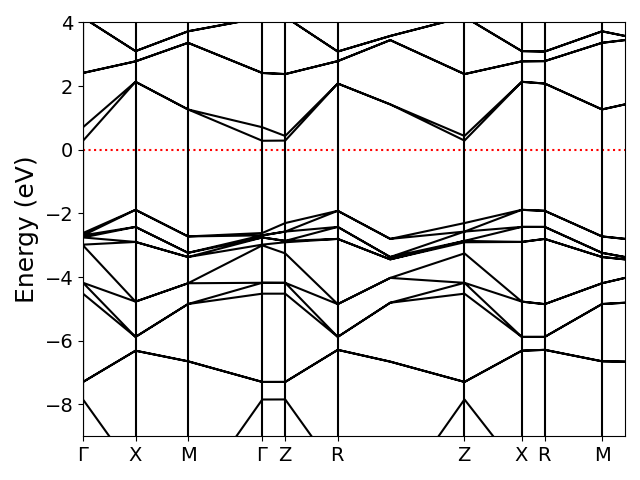
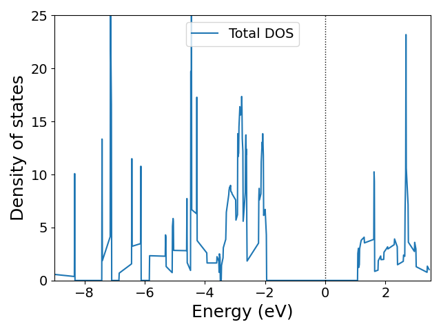

# 結果と考察

ここでは、SbOClの電子構造などについて、試行的に粗い波数メッシュ(2x2x2)を用いた計算を実施し、それに基づいて考察を加える。ここで求められた結果について、電子バンド構造と状態密度に節分けしたうえで、それぞれについて特徴についての議論を行う。

## 電子構造

まずここでは電子バンド構造に対応する計算結果について図１に示す。粗い波数メッシュでの計算結果であることからバンド構造が不連続であったり雑音が入っていたりして、判別が難しいところではあるが、本結果から観察されるようにSbOClの電子バンド構造において、価電子帯の頂点と伝導帯の底が異なる高対称点に位置していることから、SbOClは間接型半導体に分類される。本結果については、他の理論的研究から得られた結果と矛盾しないことがわかる。これは、光励起に際してフォノンの関与が必要となるため、発光効率が低くなる傾向がある。

また本研究対象物質に関するバンド構造解析により、伝導帯は平坦でバンド幅が狭いことが判明した。このような平坦性から示唆されるようなバンド幅の狭窄性は、後述する状態密度解析結果とも一致しており、電子状態分布との整合性が認められる。

## 状態密度

右下には、対象物質に関する状態密度（DOS）を図示している。使用した波数メッシュが粗いため、スペクトルの微細構造は十分に分解されておらず、DOSの形状から直接型・間接型の判別を行うには精度が不十分である。しかしながら、図から読み取れるバンドギャップの大まかな傾向は、既存の理論計算に基づく文献値と整合しており、本計算手法の信頼性をある程度支持する結果となった。

また、対象物質が遷移金属を含まない化合物であるにもかかわらず、状態密度から推定されるバンド幅は比較的狭く、電子が空間的に局在している可能性が示唆される。射影状態密度（PDOS）は今回算出していないが、特定の原子軌道への電子の強い束縛が物性に影響を与えている可能性があり、今後の解析において注目すべき点である。

加えて、本物質は層状構造を持ち、層間距離が短いことから、ファン・デル・ワールス（vdW）相互作用が結晶安定性に影響している可能性がある。このような相互作用が電子構造にも何らかの形で反映されていると考えられ、vdW補正の有無が構造的・電子的特性に与える影響については、より高精度な計算や実験的検証を通じて明らかにしていく必要がある。
